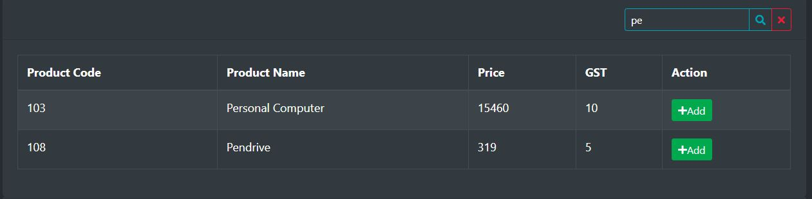

# billing-app-react-springboot

Run 'npm install' in reactjs folder.

Install dependencies : react-bootstrap, react-router-dom, axios, fortawesome

Run frontend using:- npm start

Make sure to connect to the MySql database.
Create "project" database schema.

Run backend using:- mvn spring-boot:run

The spring-boot backend will run on port 8081 and react js frontend will run on default port 3000.

# Add products in the Product Entry page.

# Update Products

# Navigate to the billing page

# Search for the items and add them to the billing list

# Enter the quantity and the total amount will get calculated.

